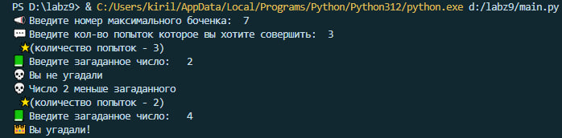
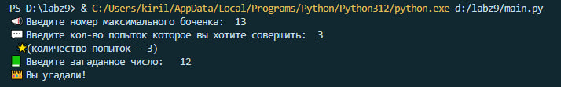
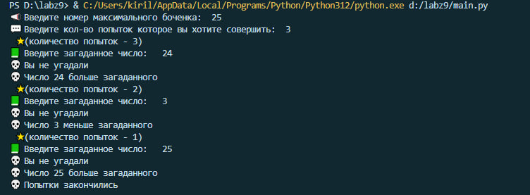

# Labz 10 🖥️
# Создатель 😎
Филиппов Кирилл Фт-220007
# Функционал программы 🔑
Компьютер загадывает число от 1 до N. У пользователя k попыток отгадать. После каждой неудачной попытки компьютер сообщает меньше или больше загаданное число. В конце игры текст с результатом (или «Вы угадали», или «Попытки закончились»).
# Запуск программы 💪
Программа может быть открыта в любой среде.
Написана в VScode
# Входные данные
Натуральные числа N и k.
# Выходные данные
Ответ на попытку ввода, ответ в конце игры.
# Тесты ☄️
Тест 1(❀❛ ֊ ❛„)♡
___

___
Тест 2(❀❛ ֊ ❛„)♡
___

___
Тест 3(❀❛ ֊ ❛„)♡
___
